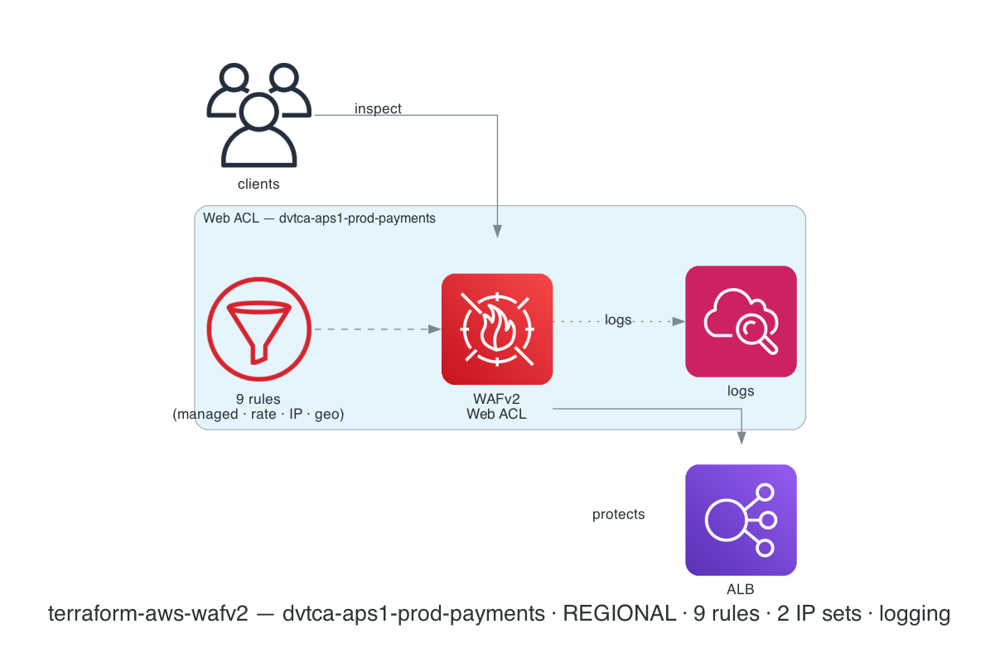

# terraform-aws-wafv2

[](https://github.com/devotica-labs/terraform-aws-wafv2/actions/workflows/ci.yml)
[](https://github.com/devotica-labs/terraform-aws-wafv2/actions/workflows/release.yml)
[](LICENSE)

> Part of the **Devotica** Terraform catalog. Follows the cloudposse module standard (README.yaml-driven docs, the `enabled`/`namespace`/`environment`/`stage`/`name`/`attributes`/`tags`/`label_order` label surface, `examples/complete`, Makefile targets) implemented **natively** — no external naming or build-harness dependencies.

## Introduction

Terraform module for an AWS **WAFv2 Web ACL** — the public-edge web application firewall. It ships an opinionated, fintech-safe default rule set and attaches to a REGIONAL resource (ALB / API Gateway / AppSync), or exposes its ARN for a CloudFront distribution.

Rather than a pass-arbitrary-rules engine, it exposes focused inputs for the rule types that matter at the edge: AWS managed rule groups, a rate limit, IP allow/block sets, and geo match.

## Usage

```hcl
module "wafv2" {
  source  = "devotica-labs/wafv2/aws"
  version = "~> 0.1"

  namespace = "dvtca"
  stage     = "prod"
  name      = "edge"

  scope = "REGIONAL"

  # Attach to the public ALB.
  association_resource_arns = [module.alb.alb_arn]

  # Defaults: AWS managed baseline (Common, KnownBadInputs, SQLi, IP reputation)
  # in block mode + a 2000-req/5-min rate limit + CloudWatch metrics.

  tags = {
    Environment = "production"
    Project     = "edge"
    Owner       = "platform@example.com"
    CostCenter  = "PLATFORM"
    ManagedBy   = "Terraform"
  }
}
```

## Examples

- [`examples/basic`](examples/basic/main.tf) — managed-rules + rate-limit baseline on an ALB.
- [`examples/complete`](examples/complete/main.tf) — per-rule overrides, a count-mode group, tighter rate limit, IP allow/block sets, geo-blocking, and Firehose logging with a redacted header.

## Defaults that matter

Annotated `# Devotica fintech default` in [`variables.tf`](variables.tf):

- **Managed rule baseline, blocking** — `AWSManagedRulesCommonRuleSet`, `KnownBadInputsRuleSet`, `SQLiRuleSet`, `AmazonIpReputationList`, all in block mode. Override per-rule to `count` while tuning, or add groups.
- **Rate limit on** — 2000 requests / 5-minute window per IP, blocked. Set `rate_limit = null` to disable.
- **`default_action = allow`** — the WAF blocks known-bad traffic via rules; flip to `block` only for an explicit allow-list posture.
- **Metrics + sampled requests on** — every rule and the ACL emit CloudWatch metrics and keep a request sample for investigation.

A `check` block enforces that rule priorities are unique across managed groups, the rate limit, IP sets, and geo rules.

## How this fits the Devotica catalog

```
            internet
               │
               ▼
   terraform-aws-wafv2  (Web ACL: managed rules + rate limit + IP/geo)
               │ associates with (REGIONAL)        │ or web_acl_id (CLOUDFRONT)
               ▼                                    ▼
       terraform-aws-alb                     CloudFront distribution
               │
               ▼
       terraform-aws-ecs-fargate / eks workloads
```

Attach the Web ACL to the `terraform-aws-alb` ARN (`association_resource_arns`), or hand `web_acl_arn` to a CloudFront distribution's `web_acl_id`. Stream logs to a `aws-waf-logs-*` CloudWatch log group / Firehose / S3 bucket.

## Makefile Targets

```text
make init       # terraform init (no backend)
make validate   # terraform fmt -check + validate
make lint       # tflint
make test       # terraform test (unit + contract, against Terraform 1.9.5)
make readme     # regenerate the terraform-docs section of README.md
```

<!-- BEGIN_ARCH -->



<sub>Generated by `.github/workflows/architecture-diagram.yml` on every push to main. Do not edit the image by hand — change the Terraform code in `examples/complete/` and the bot will regenerate it.</sub>

<!-- END_ARCH -->

## Governance

- CI runs the central reusable workflow from `devotica-labs/terraform-shared-config`: fmt, validate, tflint, tfsec/trivy, gitleaks, terraform-docs, conftest against `devotica-labs/terraform-policies`, terraform test, checkov, examples build.
- Releases are cut by `release-please` on Conventional Commits. Each release is keyless-signed via cosign and ships a CycloneDX SBOM.
- Dependabot PRs auto-approve + auto-merge once CI is green.

<!-- BEGIN_TF_DOCS -->


## Usage

### Basic

```hcl
# ---------------------------------------------------------------------------
# Provider block — CI-friendly skip flags + non-AWS-shaped placeholder creds.
# ---------------------------------------------------------------------------
provider "aws" {
  region                      = "ap-south-1"
  access_key                  = "not-a-real-aws-key"
  secret_key                  = "not-a-real-aws-secret"
  skip_credentials_validation = true
  skip_metadata_api_check     = true
  skip_requesting_account_id  = true
}

# Uses local path during development.
# Change to Registry source after first release:
#   source  = "devotica-labs/wafv2/aws"
#   version = "~> 0.1"

module "wafv2" {
  source = "../.."

  # Web ACL name composes to: dvtca-sandbox-edge
  namespace = "dvtca"
  stage     = "sandbox"
  name      = "edge"

  scope = "REGIONAL"

  # Attach to a public ALB (terraform-aws-alb output).
  association_resource_arns = [
    "arn:aws:elasticloadbalancing:ap-south-1:111122223333:loadbalancer/app/dvtca-sandbox/0123456789abcdef",
  ]

  # Fintech defaults cover the rest: AWS managed rule baseline (Common,
  # KnownBadInputs, SQLi, IP reputation) in block mode, a 2000-req/5-min
  # rate limit, and CloudWatch metrics + sampled requests on.

  tags = {
    Environment = "sandbox"
    Project     = "terraform-aws-wafv2"
    Owner       = "platform@devotica.com"
    CostCenter  = "PLATFORM-OSS"
    ManagedBy   = "Terraform"
    Repo        = "https://github.com/devotica-labs/terraform-aws-wafv2"
  }
}
```

### Complete

```hcl
# ---------------------------------------------------------------------------
# Provider block — CI-friendly skip flags + non-AWS-shaped placeholder creds.
# ---------------------------------------------------------------------------
provider "aws" {
  region                      = "ap-south-1"
  access_key                  = "not-a-real-aws-key"
  secret_key                  = "not-a-real-aws-secret"
  skip_credentials_validation = true
  skip_metadata_api_check     = true
  skip_requesting_account_id  = true
}

# Uses local path during development.
# Change to Registry source after first release:
#   source  = "devotica-labs/wafv2/aws"
#   version = "~> 0.1"

module "wafv2" {
  source = "../.."

  # Web ACL name composes to: dvtca-aps1-prod-payments
  namespace   = "dvtca"
  environment = "aps1"
  stage       = "prod"
  name        = "payments"

  scope = "REGIONAL"

  # Managed rule baseline, with one in count mode and a per-rule override.
  managed_rule_groups = [
    {
      name     = "AWSManagedRulesCommonRuleSet"
      priority = 10
      # Let large request bodies through (the API uploads documents).
      rule_action_overrides = {
        SizeRestrictions_BODY = "count"
      }
    },
    { name = "AWSManagedRulesKnownBadInputsRuleSet", priority = 20 },
    { name = "AWSManagedRulesSQLiRuleSet", priority = 30 },
    { name = "AWSManagedRulesAmazonIpReputationList", priority = 40 },
    # Observe-only while tuning.
    { name = "AWSManagedRulesLinuxRuleSet", priority = 50, count_only = true },
  ]

  # Tighter rate limit for the payments edge.
  rate_limit = {
    limit    = 1000
    priority = 100
  }

  # Always allow the office/VPN ranges; block a known-bad set.
  ip_allow_list = {
    addresses = ["203.0.113.0/24"]
    priority  = 1
  }
  ip_block_list = {
    addresses = ["198.51.100.7/32"]
    priority  = 2
  }

  # Block sanctioned jurisdictions.
  geo_block = {
    country_codes = ["KP", "IR", "SY", "CU"]
    priority      = 5
  }

  # Stream logs to a Firehose (name must start with aws-waf-logs-), redacting
  # the Authorization header.
  log_destination_configs = [
    "arn:aws:firehose:ap-south-1:111122223333:deliverystream/aws-waf-logs-payments",
  ]
  redacted_fields = [
    { single_header = ["authorization"] },
  ]

  # Attach to the public ALB.
  association_resource_arns = [
    "arn:aws:elasticloadbalancing:ap-south-1:111122223333:loadbalancer/app/dvtca-prod-payments/0123456789abcdef",
  ]

  tags = {
    Environment = "production"
    Project     = "payments"
    Owner       = "platform@devotica.com"
    CostCenter  = "PLATFORM"
    ManagedBy   = "Terraform"
    Repo        = "https://github.com/devotica-labs/terraform-aws-wafv2"
  }
}
```

## Requirements

| Name | Version |
| ---- | ------- |
| <a name="requirement_terraform"></a> [terraform](#requirement\_terraform) | >= 1.5.0 |
| <a name="requirement_aws"></a> [aws](#requirement\_aws) | >= 5.0.0 |
## Providers

| Name | Version |
| ---- | ------- |
| <a name="provider_aws"></a> [aws](#provider\_aws) | 6.52.0 |
## Resources

| Name | Type |
| ---- | ---- |
| [aws_wafv2_ip_set.allow](https://registry.terraform.io/providers/hashicorp/aws/latest/docs/resources/wafv2_ip_set) | resource |
| [aws_wafv2_ip_set.block](https://registry.terraform.io/providers/hashicorp/aws/latest/docs/resources/wafv2_ip_set) | resource |
| [aws_wafv2_web_acl.this](https://registry.terraform.io/providers/hashicorp/aws/latest/docs/resources/wafv2_web_acl) | resource |
| [aws_wafv2_web_acl_association.this](https://registry.terraform.io/providers/hashicorp/aws/latest/docs/resources/wafv2_web_acl_association) | resource |
| [aws_wafv2_web_acl_logging_configuration.this](https://registry.terraform.io/providers/hashicorp/aws/latest/docs/resources/wafv2_web_acl_logging_configuration) | resource |
## Inputs

| Name | Description | Type | Default | Required |
| ---- | ----------- | ---- | ------- | :------: |
| <a name="input_association_resource_arns"></a> [association\_resource\_arns](#input\_association\_resource\_arns) | REGIONAL only: ARNs of resources (e.g. ALBs) to associate this Web ACL with. For CloudFront, set web\_acl\_id on the distribution instead. | `list(string)` | `[]` | no |
| <a name="input_attributes"></a> [attributes](#input\_attributes) | Additional attributes appended to the id (e.g. ["workers"]). | `list(string)` | `[]` | no |
| <a name="input_cloudwatch_metrics_enabled"></a> [cloudwatch\_metrics\_enabled](#input\_cloudwatch\_metrics\_enabled) | Emit CloudWatch metrics for the Web ACL and each rule. | `bool` | `true` | no |
| <a name="input_default_action"></a> [default\_action](#input\_default\_action) | What to do with a request that matches no rule: allow or block. The fintech default is allow — rules block known-bad traffic; switch to block only for an allow-list posture. | `string` | `"allow"` | no |
| <a name="input_delimiter"></a> [delimiter](#input\_delimiter) | Delimiter joining the id segments. | `string` | `"-"` | no |
| <a name="input_description"></a> [description](#input\_description) | Description of the Web ACL. Defaults to the composed name. | `string` | `null` | no |
| <a name="input_enabled"></a> [enabled](#input\_enabled) | Set to false to make this module a no-op (create nothing). | `bool` | `true` | no |
| <a name="input_environment"></a> [environment](#input\_environment) | Environment segment (e.g. a short region code). | `string` | `null` | no |
| <a name="input_geo_allow"></a> [geo\_allow](#input\_geo\_allow) | Allow only these countries — blocks everything else (default\_action should stay allow; this rule blocks non-listed countries via a NOT match). | <pre>object({<br/>    country_codes = list(string)<br/>    priority      = number<br/>  })</pre> | `null` | no |
| <a name="input_geo_block"></a> [geo\_block](#input\_geo\_block) | Block requests from these ISO-3166 country codes (e.g. ["KP","IR"]). | <pre>object({<br/>    country_codes = list(string)<br/>    priority      = number<br/>  })</pre> | `null` | no |
| <a name="input_id_length_limit"></a> [id\_length\_limit](#input\_id\_length\_limit) | Truncate the composed id to at most this many characters. 0 means no limit. | `number` | `0` | no |
| <a name="input_ip_allow_list"></a> [ip\_allow\_list](#input\_ip\_allow\_list) | Create an IP set and a rule that ALLOWs these CIDRs (evaluated before managed rules at the given priority). | <pre>object({<br/>    addresses  = list(string)<br/>    priority   = number<br/>    ip_version = optional(string, "IPV4")<br/>  })</pre> | `null` | no |
| <a name="input_ip_block_list"></a> [ip\_block\_list](#input\_ip\_block\_list) | Create an IP set and a rule that BLOCKs these CIDRs. | <pre>object({<br/>    addresses  = list(string)<br/>    priority   = number<br/>    ip_version = optional(string, "IPV4")<br/>  })</pre> | `null` | no |
| <a name="input_label_order"></a> [label\_order](#input\_label\_order) | Order of the label segments used to build the id. Allowed keys: namespace, environment, stage, name, attributes. | `list(string)` | <pre>[<br/>  "namespace",<br/>  "environment",<br/>  "stage",<br/>  "name",<br/>  "attributes"<br/>]</pre> | no |
| <a name="input_label_value_case"></a> [label\_value\_case](#input\_label\_value\_case) | Case applied to the composed id: lower, upper, or none. | `string` | `"lower"` | no |
| <a name="input_log_destination_configs"></a> [log\_destination\_configs](#input\_log\_destination\_configs) | Logging destination ARNs (CloudWatch log group / Kinesis Firehose / S3) — each name must start with `aws-waf-logs-`. Empty disables logging. | `list(string)` | `[]` | no |
| <a name="input_managed_rule_groups"></a> [managed\_rule\_groups](#input\_managed\_rule\_groups) | AWS (or marketplace) managed rule groups to attach. Defaults to a fintech baseline: Common, KnownBadInputs, SQLi, and the Amazon IP reputation list — all in block mode. | <pre>list(object({<br/>    name        = string<br/>    vendor_name = optional(string, "AWS")<br/>    priority    = number<br/>    # Set true to run the group in count mode (observe only, no blocking).<br/>    count_only = optional(bool, false)<br/>    # Per-rule action overrides within the group (rule_name => "count"|"allow"|"block").<br/>    rule_action_overrides = optional(map(string), {})<br/>  }))</pre> | <pre>[<br/>  {<br/>    "name": "AWSManagedRulesCommonRuleSet",<br/>    "priority": 10<br/>  },<br/>  {<br/>    "name": "AWSManagedRulesKnownBadInputsRuleSet",<br/>    "priority": 20<br/>  },<br/>  {<br/>    "name": "AWSManagedRulesSQLiRuleSet",<br/>    "priority": 30<br/>  },<br/>  {<br/>    "name": "AWSManagedRulesAmazonIpReputationList",<br/>    "priority": 40<br/>  }<br/>]</pre> | no |
| <a name="input_name"></a> [name](#input\_name) | Solution / base name (e.g. "app"). | `string` | `null` | no |
| <a name="input_namespace"></a> [namespace](#input\_namespace) | Namespace / org prefix (e.g. "dvtca"). | `string` | `null` | no |
| <a name="input_rate_limit"></a> [rate\_limit](#input\_rate\_limit) | Rate-based rule: blocks an IP exceeding `limit` requests in any 5-minute window. Set to null to disable. | <pre>object({<br/>    limit              = optional(number, 2000)<br/>    priority           = optional(number, 100)<br/>    aggregate_key_type = optional(string, "IP")<br/>    action             = optional(string, "block")<br/>  })</pre> | `{}` | no |
| <a name="input_redacted_fields"></a> [redacted\_fields](#input\_redacted\_fields) | Fields redacted from the logs (e.g. an Authorization header). | <pre>list(object({<br/>    method        = optional(bool, false)<br/>    query_string  = optional(bool, false)<br/>    uri_path      = optional(bool, false)<br/>    single_header = optional(list(string))<br/>  }))</pre> | `[]` | no |
| <a name="input_regex_replace_chars"></a> [regex\_replace\_chars](#input\_regex\_replace\_chars) | Regex (in /.../ form) of characters stripped from each id segment. | `string` | `"/[^-a-zA-Z0-9]/"` | no |
| <a name="input_sampled_requests_enabled"></a> [sampled\_requests\_enabled](#input\_sampled\_requests\_enabled) | Store a sample of inspected requests for each rule (visible in the console). | `bool` | `true` | no |
| <a name="input_scope"></a> [scope](#input\_scope) | REGIONAL (ALB / API Gateway / AppSync) or CLOUDFRONT. CLOUDFRONT web ACLs must be created in us-east-1. | `string` | `"REGIONAL"` | no |
| <a name="input_stage"></a> [stage](#input\_stage) | Stage / account segment (e.g. "prod"). | `string` | `null` | no |
| <a name="input_tags"></a> [tags](#input\_tags) | Additional tags merged onto every taggable resource. | `map(string)` | `{}` | no |
## Outputs

| Name | Description |
| ---- | ----------- |
| <a name="output_ip_set_allow_arn"></a> [ip\_set\_allow\_arn](#output\_ip\_set\_allow\_arn) | ARN of the allow-list IP set (null if none). |
| <a name="output_ip_set_block_arn"></a> [ip\_set\_block\_arn](#output\_ip\_set\_block\_arn) | ARN of the block-list IP set (null if none). |
| <a name="output_logging_configuration_id"></a> [logging\_configuration\_id](#output\_logging\_configuration\_id) | ID of the Web ACL logging configuration (null if logging disabled). |
| <a name="output_web_acl_arn"></a> [web\_acl\_arn](#output\_web\_acl\_arn) | The ARN of the WAFv2 Web ACL. For CloudFront, set this as the distribution's web\_acl\_id. |
| <a name="output_web_acl_capacity"></a> [web\_acl\_capacity](#output\_web\_acl\_capacity) | Web ACL capacity units (WCUs) consumed by the rules. |
| <a name="output_web_acl_id"></a> [web\_acl\_id](#output\_web\_acl\_id) | The ID of the WAFv2 Web ACL. |
| <a name="output_web_acl_name"></a> [web\_acl\_name](#output\_web\_acl\_name) | The name of the Web ACL. |
<!-- END_TF_DOCS -->

## Related Projects

- [terraform-aws-alb](https://github.com/devotica-labs/terraform-aws-alb) — the public ALB this Web ACL protects.

## References

- [AWS WAF Web ACLs](https://docs.aws.amazon.com/waf/latest/developerguide/web-acl.html)
- [AWS Managed Rule Groups](https://docs.aws.amazon.com/waf/latest/developerguide/aws-managed-rule-groups-list.html)
- [Rate-based rules](https://docs.aws.amazon.com/waf/latest/developerguide/waf-rule-statement-type-rate-based.html)

## License

Apache-2.0. See [`LICENSE`](LICENSE) and [`NOTICE`](NOTICE).
